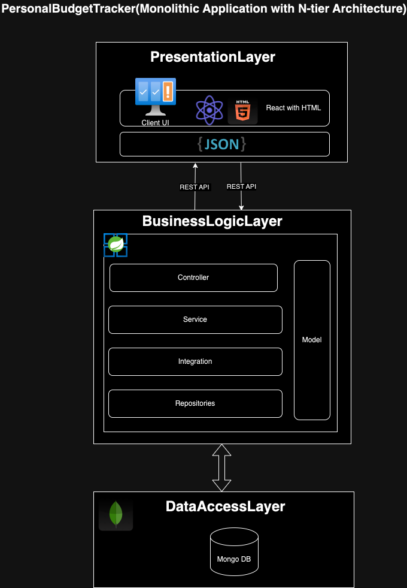

# PersonalBudgetTracker
 ## Problem Statement
The Personal Budget Tracker application helps users manage their finances by tracking income, expenses, budgets, and savings goals. Users can securely register, log in, and access endpoints to record and view financial transactions. The system provides automatic notifications when users exceed their budgets or reach savings milestones, and users receive a rank based on their financial performance. Additionally, users can export financial records for personal use or analysis.
 ## Key Features
- **Income and Expense Tracking**: 
  - Users can log all income and expenses.
  - Transactions can be categorized (e.g., Food, Transportation).

- **Budget Management**:
  - Set monthly budgets for each spending category.
  - Receive alerts if spending exceeds the budget.

- **Savings Goals**:
  - Set and track progress toward specific savings goals.
  - Visual indicators show goal completion status.
  - Based of the number of completion goal user's rank will increase.(Silver, Gold and Platinum)

- **Notifications**:
  - Email for budget exceedance or goal updates.
  - Reminders to review spending patterns.

- **Dashboard**:
  - Provides an overview of income, expenses, budget usage, and goal progress.

- **Financial Reports**:
  - Generate/download in CSV for monthly or custom reports to analyze spending.
  - Track trends in expenses and income over time.

- **User Authentication**:
  - Secure user accounts for tracking and managing personal financial data.
 

## Architecture

## Class Diagram

## ER Diagram

